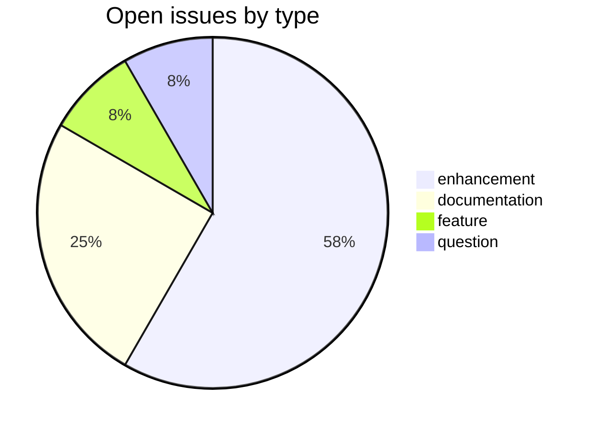
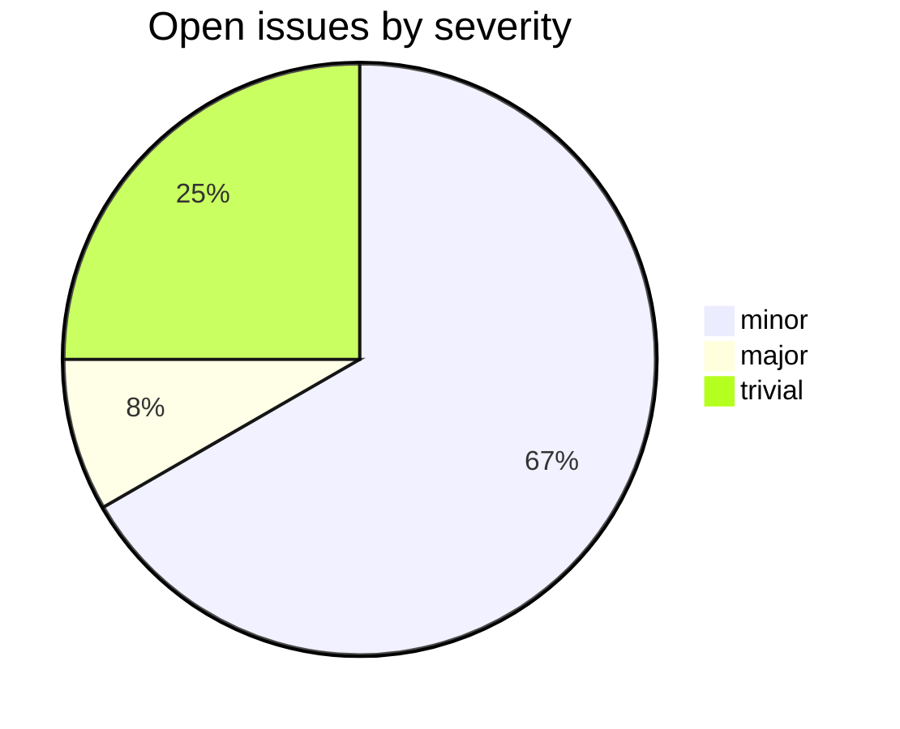

# csl-inflect

CDSL **processing-tool** repository in the Sanskrit Lexicon project.
Generates declensions and conjugations for CDSL headwords.

## Tech Stack

- **Runtime**: Python 3
- **Build**: plain `python` scripts
- **Input**: CDSL headwords + Huet/Deshpande paradigm data
- **Output**: per-headword declension / conjugation tables

## Issues Overview

Snapshot 2026-05-29: 12 open.

### By Milestone

| Milestone | Open | Closed | Total |
|---|---:|---:|---:|
| API Stability | 0 | 0 | 0 |
| User Experience | 8 | 0 | 8 |
| Data Quality | 0 | 0 | 0 |
| Developer Experience | 3 | 0 | 3 |
| Community | 1 | 0 | 1 |

### By Type

### By Severity

## GitHub Issue Conventions

Follows the [Cologne tooling-repo taxonomy](https://github.com/sanskrit-lexicon/csl-observatory/blob/main/runbook/cologne-tooling-runbook.md):

- **17 type labels**, **4 severity levels**, **5 milestones**
- **Domain labels** scoped to processing-tool: `domain:morphology`, `domain:normalization`, `domain:lookup`
- **Org Project**: [Tooling Roadmap](https://github.com/orgs/sanskrit-lexicon/projects/9)

---
*Generated by Cologne Tooling Runbook on 2026-05-29*
